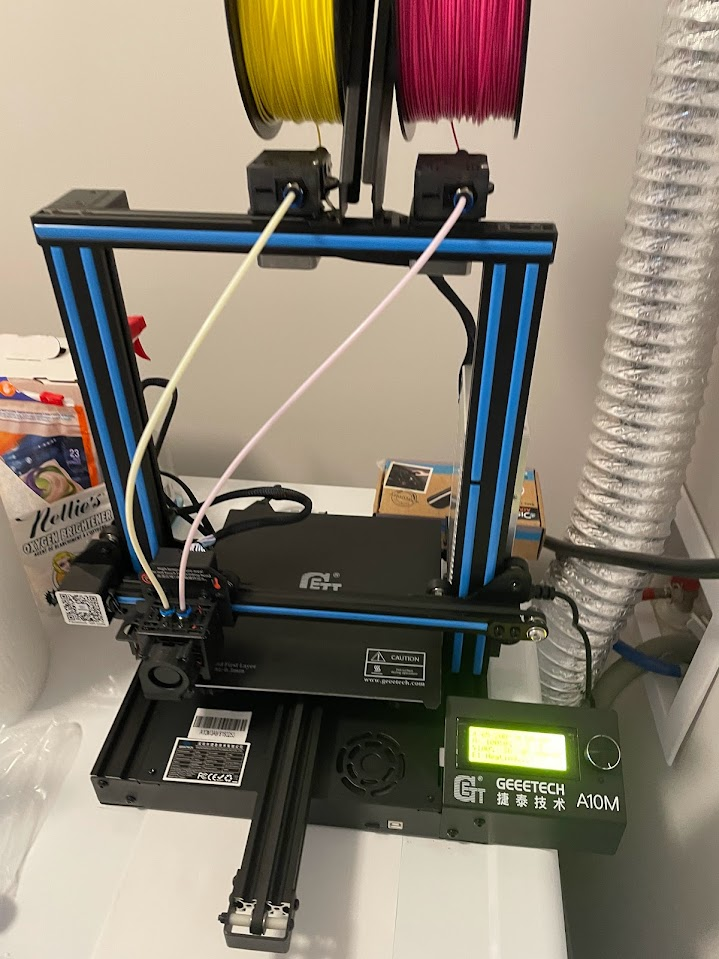

# Geeetech A10M

[Official wiki](https://wiki.geeetech.com/index.php/Geeetech_A10M_3D_printer)

## Steps done

1. Added 3D-Touch level sensor
1. Converted to Klipper FW
1. [Created driver for LCD screen](https://github.com/Klipper3d/klipper/pull/6639)
1. During callibrations found that Z-axis is wobbling due to single lead screw
1. Got 4 to 1 mixing printer [Zonestar Z9V5Pro](../Z9V5/z9v5.md) and stopped playing with it

