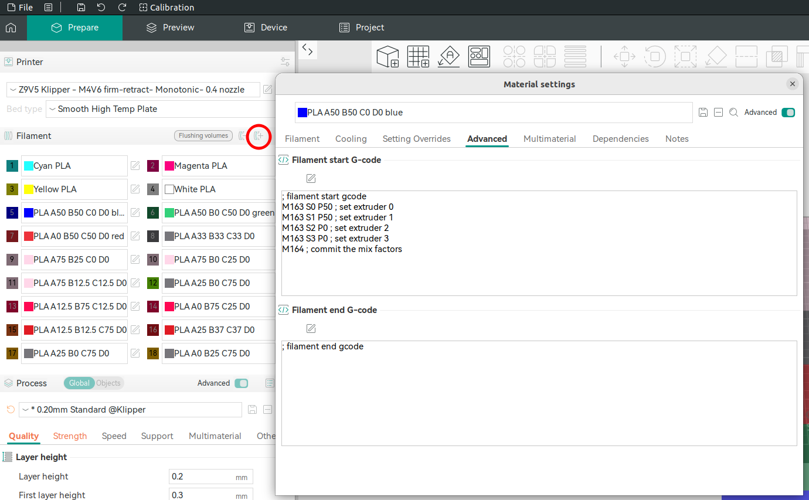
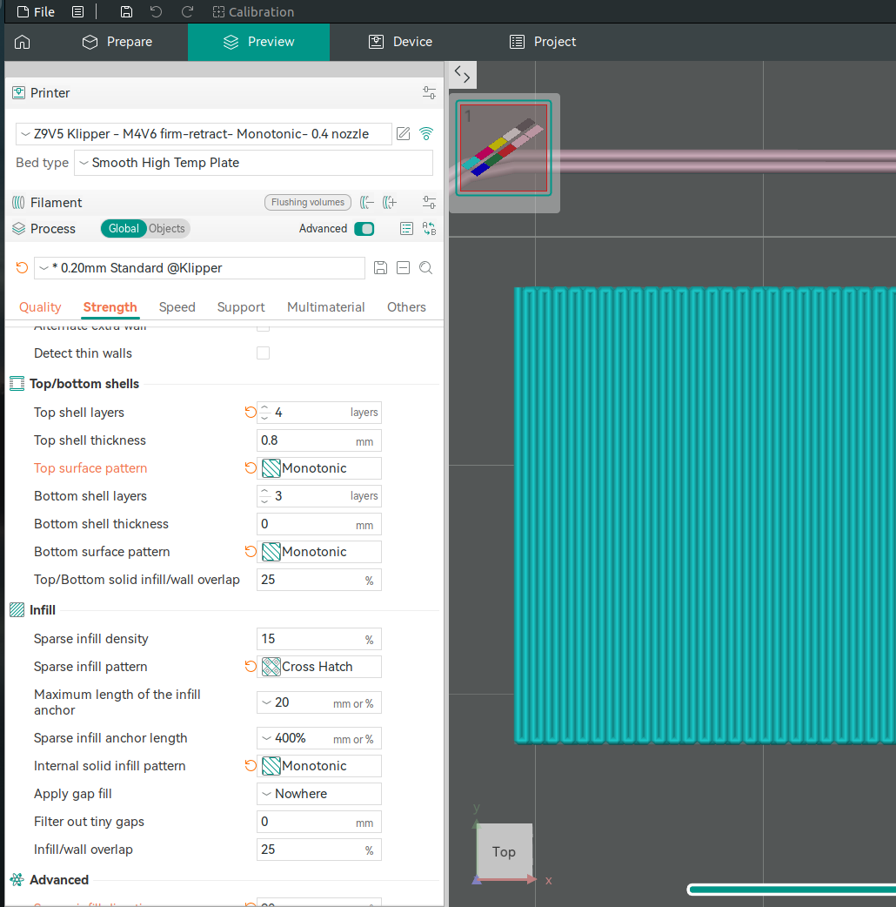
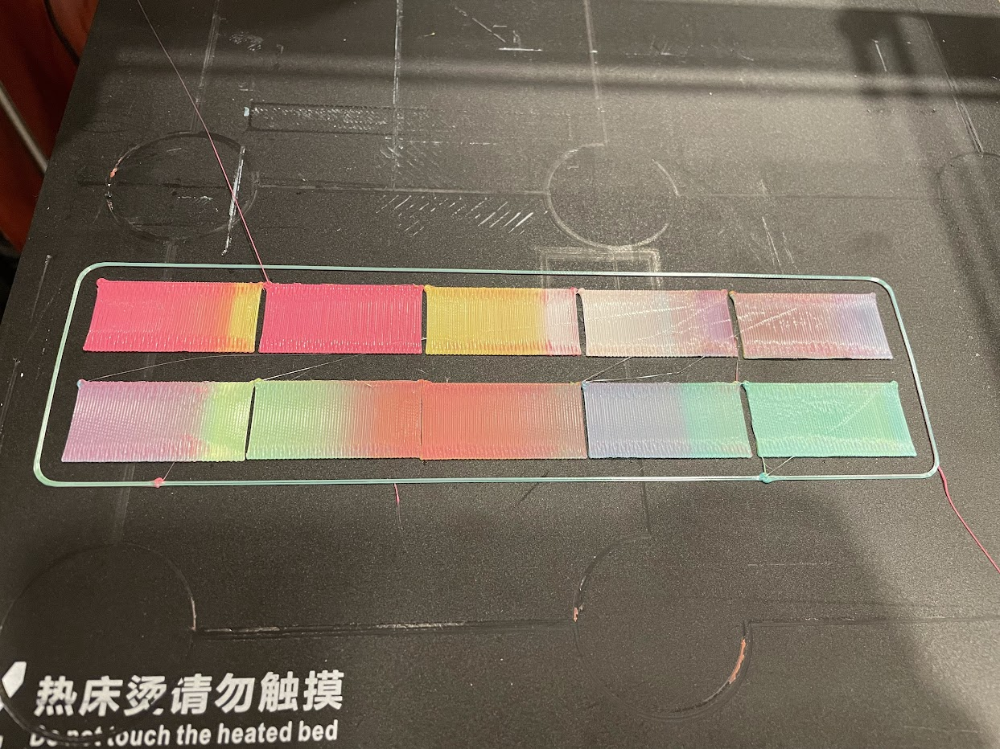
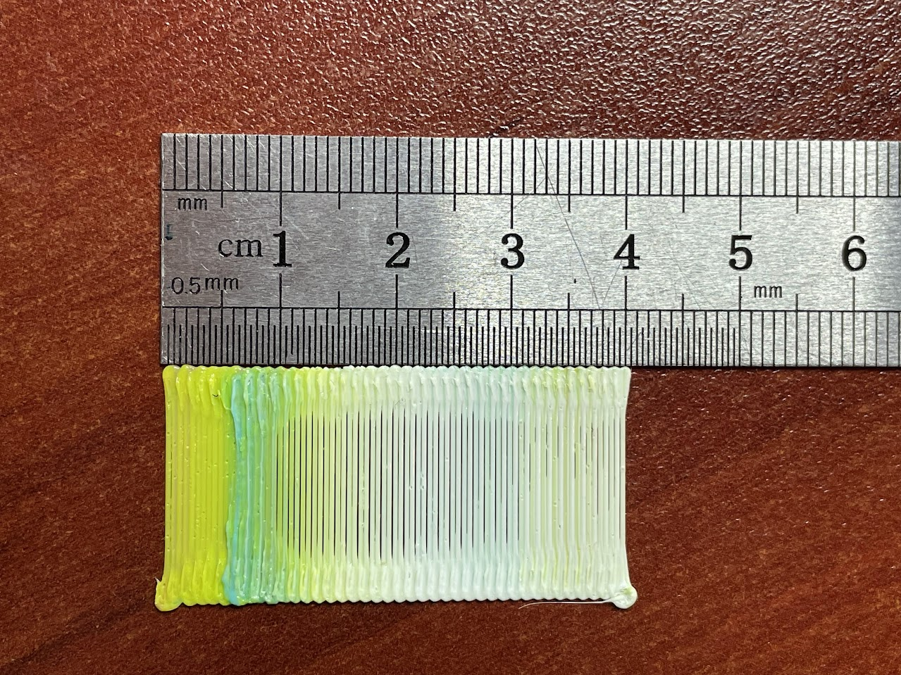
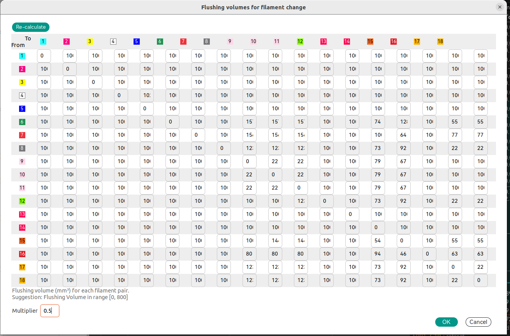
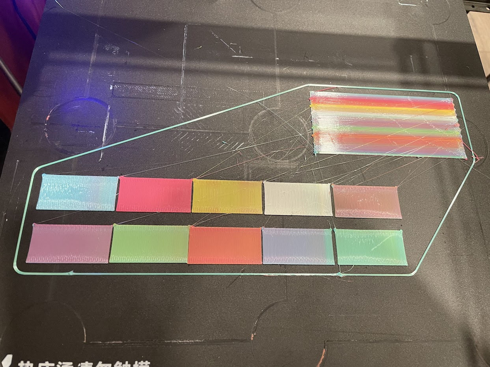

1. TOC
{:toc}

## Defining colors
The current way that I found to define colors is to add new filament and specify in `Filament start G-code` desired mix ratio:
```
; filament start gcode
M163 S0 P50 ; set extruder 0 
M163 S1 P50 ; set extruder 1 
M163 S2 P0 ; set extruder 2 
M163 S3 P0 ; set extruder 3 
M164 ; commit the mix factors
```

The missing steps:
1. How to adjust color of displayed rectangle and on model preview (they are different).
2. How to support many colors without creating "new filament" for each one



## Setting purge volumes

To measure purge volumes I created rectangles and modified shell and infill style and direction to create "snake" like pattern to be able to visually see color change and measure distance purged:

  

The rectangle's size is 20x40mm and the result of printing without purging (prime tower) is:  

\* the print was done from right to left with second pink rectangle printed out of order and in wrong color -> it was last and of the same color as previous left most so no contamination.  

Based on the measurements, the color switches predominantly to white after approximately 15 mm. However, there are still small traces of contamination—cyan between 25 mm and 30 mm, and yellow between 30 mm and 40 mm.


Example of purge volume calculation:
<div style="text-align: left">
$$
Head = 0.4mm \\
h_{Layer} = 0.3mm \\
A_{crossection} = 0.4\times0.3=0.12mm^2 \\
W = 20mm \\
L = 15mm \\
dist = 20*15/0.4 = 750mm \\
Volume = 750*0.12 = 90 mm^3 \\
$$
</div>

The $$100mm^3$$ number was updated in purge volumes for filaments in use:  




The results after updating the flushing volumes and enabling prime tower:  

\* the bottom right transition by mistake was skipped and had smaller number


