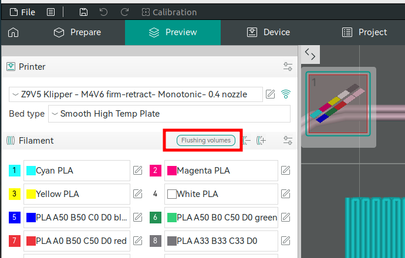
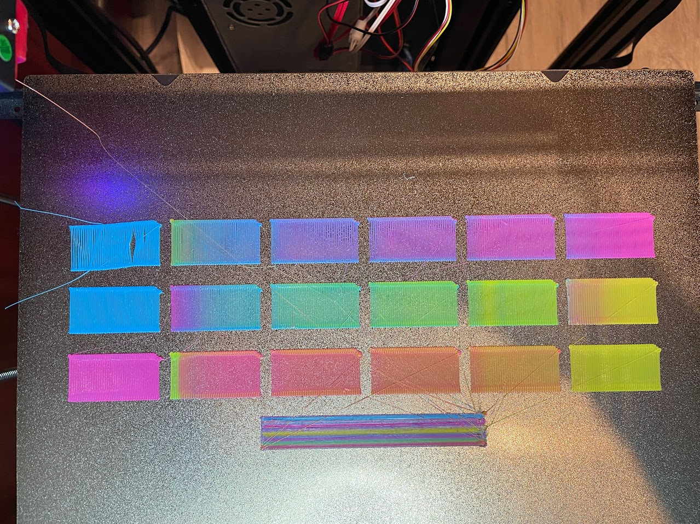
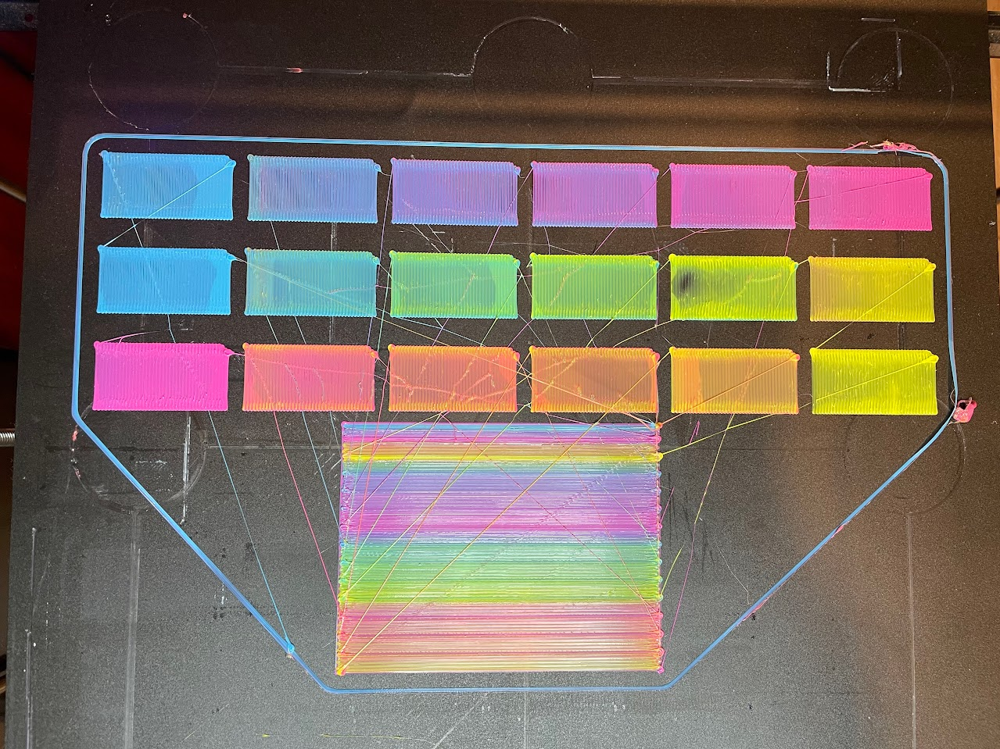

1. TOC
{:toc}


## OrcaSlicer macro execution order during print

From adding comments to all G-Code macros in Printer/Filament settings, slicing and inspecting file, tried to understand execution order:

 1. Machine Start Macro
 2. Change Filament Macro (from `Printer settings`)
 3. `T1` - tool activation G-code command
 4. Filament_1 Start Macro (from `Filament settings`)
 5. Before Layer Change Macro
 6. Time Lapse Macro
 7. Layer Change Macro
 8. Change Extrusion Role Macro (Type: Inner wall)
 9. Change Extrusion Role Macro (Type: Outer wall)
 10. Change Extrusion Role Macro (Type: Bottom surface)
 11. Filament_1 End Macro (from `Filament settings`)
 12. Change Filament Macro (from `Printer settings`)
 13. `T0` - tool activation G-code command
 14. Filament_0 Start Macro (from `Filament settings`)
 15. Change Extrusion Role Macro (Type: Inner wall)
 16. Change Extrusion Role Macro (Type: Outer wall)
 17. Change Extrusion Role Macro (Type: Bottom surface)
 18. Filament_0 End Macro (from `Filament settings`)
 19. Change Filament Macro (from `Printer settings`)
 20. `T2` - tool activation G-code command
     
     ...
 21. Filament_0 End Macro (from `Filament settings`)
     
     ... per filament
 22. Filament_3 End Macro (from `Filament settings`)
 23. Machine_end


## Defining colors
The current way that I found to define colors is to add new filament and specify in `Filament start G-code` desired mix ratio:
```
; filament start gcode
M163 S0 P50 ; set extruder 0 
M163 S1 P50 ; set extruder 1 
M163 S2 P0 ; set extruder 2 
M163 S3 P0 ; set extruder 3 
M164 ; commit the mix factors
```

The missing steps:
1. How to adjust color of displayed rectangle and on model preview (they are different).
2. How to support many colors without creating "new filament" for each one


## Setting purge volumes

To measure purge volumes I created rectangles and modified shell and infill style and direction to create "snake" like pattern to be able to visually see color change and measure distance purged:

  

The rectangle's size is 20x40mm and the result of printing without purging (prime tower) is:  

\* the print was done from right to left with second pink rectangle printed out of order and in wrong color -> it was last and of the same color as previous left most so no contamination.  

Based on the measurements, the color switches predominantly to white after approximately 15 mm. However, there are still small traces of contamination—cyan between 25 mm and 30 mm, and yellow between 30 mm and 40 mm.


Example of purge volume calculation:
<div style="text-align: left">
$$
Head = 0.4mm \\
h_{Layer} = 0.3mm \\
A_{crossection} = 0.4\times0.3=0.12mm^2 \\
W = 20mm \\
L = 15mm \\
dist = 20*15/0.4 = 750mm \\
Volume = 750*0.12 = 90 mm^3 \\
$$
</div>

The $$100mm^3$$ number was updated in purge volumes for filaments in use:  



The results after updating the flushing volumes and enabling prime tower:  

\* the bottom right transition by mistake was skipped and had smaller number

## Checking mixed colors

I created rectangles of different mix ratios:  
\* OrcaSlicer `v2.3.0` (the latest release) and older [have bug](https://github.com/SoftFever/OrcaSlicer/issues/8798) in flushing volumes on first layer so not enough filament purged and color changes in the middle 


OrcaSlice `v2.3.1-dev`(next version in development to be released) has [the bug fixed PR#9235](https://github.com/SoftFever/OrcaSlicer/pull/9235)



## TODO: 
1. improve mixing (try different inserts into print head)
2. fix first layer (add adaptive bed leveling - when bed probed exactly under printed model each print)
3. try improve oozing and plastic blobs (dry filament as a first step, try to play with settings)