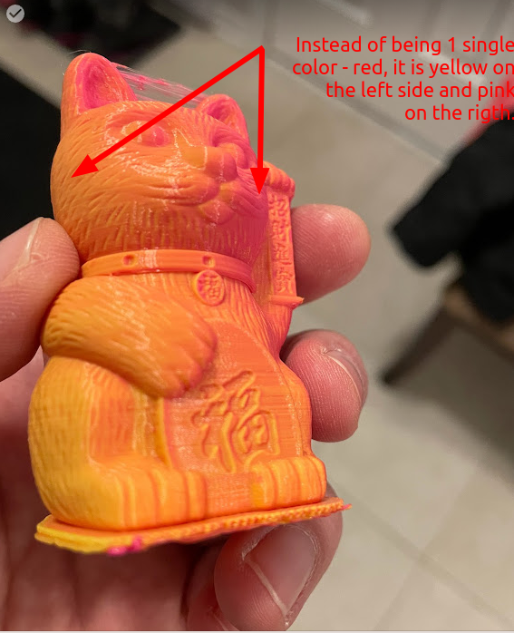
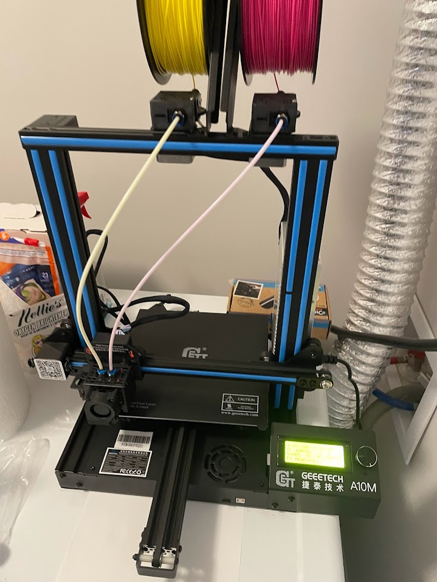
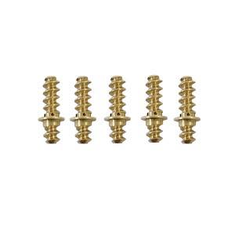

# CMYK-3Dprint

## Concept and Challenges

When I first saw a 3D printer producing objects in a single color, I wondered: if you could print with four colors, could you mix them to create a broader palette, similar to an inkjet printer? I later discovered that many others had the same idea and attempted it with varying degrees of success. While the concept is feasible, it presents several challenges:

1. **Mixing** – The "Aquafresh" or "toothpaste" effect occurs when colors do not fully blend, resulting in different colors visible from different angles. Might be reduced using transluscent filament.  
    
2. **Extrusion** – More complex printheads require stronger extruders to push filament through curved internal paths.
3. **Clogs** – Frequent clogs can occur as unused colors melt and adhere inside the printhead.
4. **Stringing** – Larger printhead volumes hold more melted plastic, which can drip even when not extruding, especially during travel moves.
5. **Control** – Simultaneously operating four colors demands more advanced firmware and slicer support.
6. **Color Consistency** – Filaments from different manufacturers or batches may have varying melting points, properties, moisture content, or pigments, making consistent color mixing difficult. Even rolls from the same manufacturer can yield different results. It is hard to calibrate, configure and use.
7. **Purging Volumes** – Color changes are not instantaneous; it takes time and material to purge the old mixture. The required purge volume is inconsistent, and some colors (e.g. black) affect longer the mix color, leading to significant material and time waste in total.

## Existing Products

| # | Manufacturer | Model | Image | Details | Comments |
|---|--------------|-------|-------|---------|----------|
| 1 | Rep-Rap      | [3-to-1](https://richrap.blogspot.com/2012/08/3-way-quick-fit-extruder-and-colour.html) |  | done in 2012 3 to 1 mixing       | contains links to some reports about color mixing |
| 2 | Rep-Rap      | [Diamond Hotend](https://reprap.org/wiki/Diamond_Hotend) |  | 3 to 1 |  [Experiments by René K. Müller](https://xyzdims.com/2019/05/07/3d-printing-diamond-hotend-or-mixed-color-deeper-dive/)|
| 3 | Geeetech | [A10M/T](https://www.geeetech.com/Documents/A10T%20User%20Manual_V1.00%20.pdf) A20M/T A30M/T|  | A10/A20/A30 Mixing: M - 2 to 1 T - 3 to 1 | The A10M, my first 3D printer, has Z-axis instability caused by a single lead screw setup. This makes accurate bed calibration difficult and negatively affects print quality. |
| 4 | Geeetech | [Mizar M](https://wiki.geeetech.com/index.php/Geeetech_Mizar_M_3D_printer) | | 2 to 1| It has a metallic component inside the nozzle that mixes the colors, reducing the “Aquafresh” effect.  |
| 5 | M3D | [Crane Quad](https://crane.printm3d.com/crane-quad-guide/unboxing-and-assembly#additional-information-1)| | 4 to 1 | |
| 6 | Zonestar | [Z8PM4Pro](https://github.com/ZONESTAR3D/Z8P) |  | 4 to 1 Ender style XYZ||
| 7 | Zonestar | [Z9V5Pro](https://github.com/ZONESTAR3D/Z9/tree/main/Z9V5) |  | 4 to 1 Core XY Hot ends: [E4(non-mixing) or M4V6(mixing)](https://github.com/ZONESTAR3D/Upgrade-kit-guide/blob/main/HOTEND/FAQ_M4E4.md#whats-different-between-e4-and-m4-hotend) | I bought for $200CAD on marketplace "mixing" printer, but in fact it was Z9V5Pro-MK4 with non-mixing E4 extruder. I ordered M4V6 mixing hot end and my experiments are logged [here](Z9V5/).
| 8 | Cetus     | [Cetus2](https://www.3dptk.com/review/cetus2-review) |  | 2 to 1 | The official site is down so links to review. Very small purge volume to change color - but as a result heavy "aquafresh" effect|
| 9 | DIY Somei3deas | [6-input Hot End](https://somei3deas.wordpress.com/2020/07/02/my-6-input-hot-end-part-11/) |  | 6 to 1 | DIY project with detailed build logs and experiments; [YouTube channel @deckingman](https://www.youtube.com/watch?v=1j0UH6ctTDI) |

My first 3D printer was the [Geeetech A10M](A10M/). Later, I spotted a [ZoneStar Z9V5Pro](Z9V5/) on Facebook Marketplace just a few minutes’ drive away. It had been listed for months, and when the seller finally dropped the price to 200 CAD, I bought it as a birthday present for myself.

Some notes about them might be found in this section.