1. TOC
{:toc}

## ZoneStar Z9V5Pro
[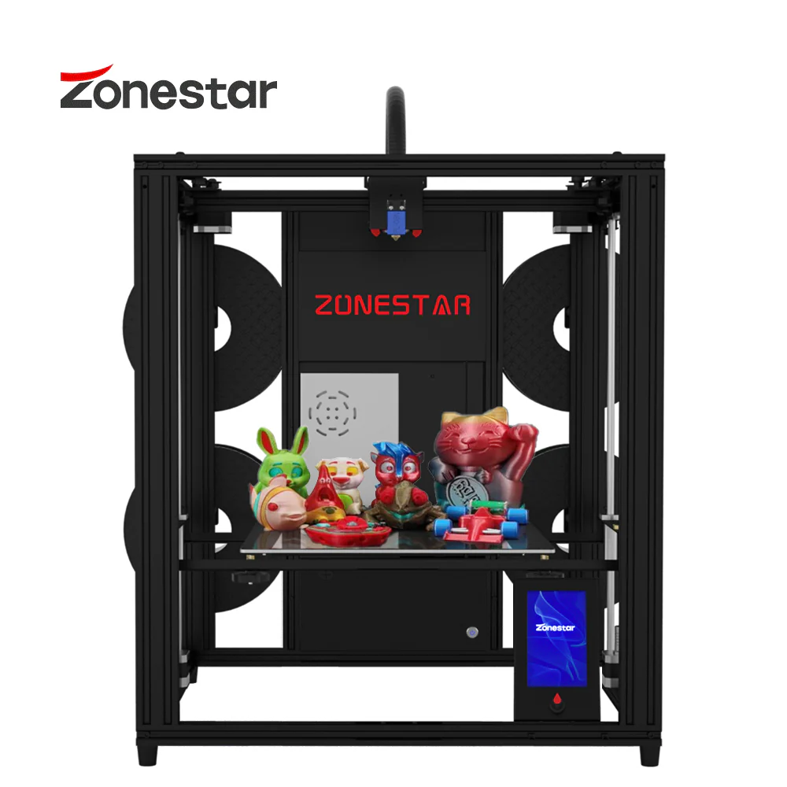](https://www.zonestar3dshop.com/products/4-extruder-multi-color-large-size-fdm-3d-printer-diy-kit-z9v5pro)

* Core XY
* 4 to 1 mixing/non-mixing hot-ends
* 300x300x400 mm (actual bed 310x310mm)
* STM32 based board

### Printer internals overview
The covers are hold by 4 screws each:
* Top contains stepper motors of extruders and connectors to printing head:  
[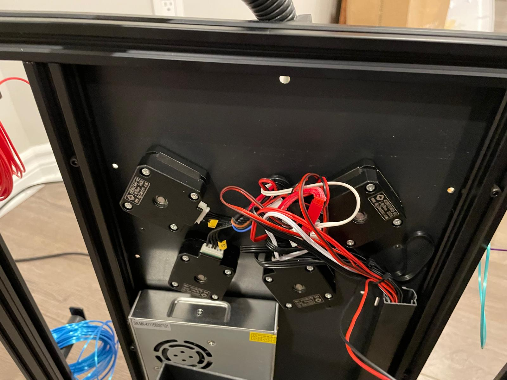](resources/undercover-top.jpg)
* Bottom contains the main board:  
[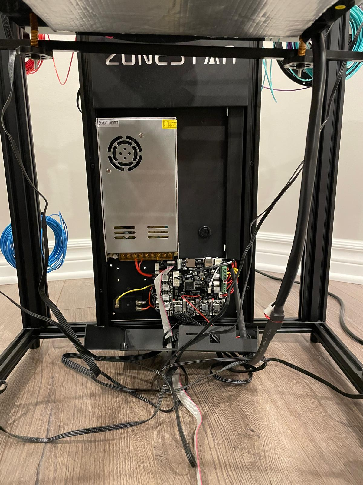](resources/undercover-bottom.jpg)
[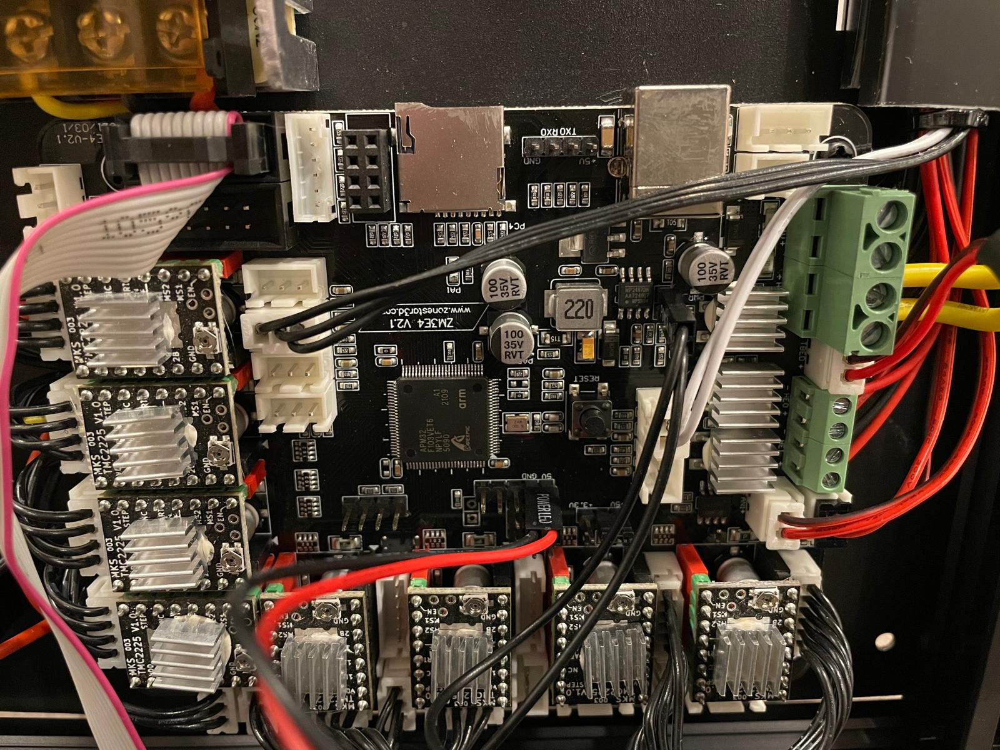](resources/board.jpg)

The board is `ZM3E4 V2.1`:
* Schematics and parts placement were found in [Zonestar3D GitHub](https://github.com/ZONESTAR3D/Control-Board/tree/main/32bit/ZM3E4/ZM3E4V21)
* In schematics, it is `STM32F103VCT6`, but on board, it is clone `APM32 F103VET6` by [Geehy](https://global.geehy.com/product/fifth/APM32F103)

## Klipperize Z9V5Pro-MK4 (with non mixing E4 hotend)

### Found references

* Forked from: [Z9V5Pro-MK4-Klipper](https://github.com/Z9V5PRO/Z9V5Pro-MK4-Klipper)  
* In addition, found this: [Z9V5-mixing-klipper](https://github.com/Nathan22211/Z9V5-mixing-klipper)
* My dynamically updated [profile](https://github.com/bazarovdev/z9v5-klipper)


### Klipper Flashing procedure
1. Obtain Klipper by clonning it: [klipper3D](https://github.com/Klipper3d/klipper)
1. Configure by going to cloned folder in terminal and run
    ```
    make menuconfig
    ```
    in menu choose:
    * MCU Architecture - STM32
    * Processor model - STM32F103
    * Bootloader offset - 20KiB bootloader
    * Communication interface (USB(on PA11/PA12))
    and press `Q` and `Y` to save and exit
1. Build FW file by running:
    ```
    make
    ```
    it should complete without errors (otherwise install dependencies till it works).
    You will get `klipper.bin` in `./out/` folder.
1. Prepairing uSD-Card:
    1. Copy the `klipper.bin` to root of uSD-Card and rename it to `firmware.bin` 
    1. remove `old_fw.bin` if exists
    1. Unmount (eject) uSD-Card to cause `fsync`
1. Flashing printer:
    1. Power off power supply (PSU) of the printer
    1. Insert uSD-Card
    1. Power on PSU
    1. Press and hold for few sec small power button on bottom main board cover (the Zonestar logo might blink few times but will stay dark after it).

In my case, the printer wasn't found and power cycle didn't help. Looking on Linux logs using `journalctl -f` showed that it had USB detection errors and it was solved by eliminating USB-hub and plugging-in printer directly into PC:
Errors via hub:
```
Nov 02 02:44:20 pc-name kernel: usb 1-10.4: new low-speed USB device number 71 using xhci_hcd
Nov 02 02:44:20 pc-name kernel: usb 1-10.4: device descriptor read/64, error -32
Nov 02 02:44:20 pc-name kernel: usb 1-10.4: device descriptor read/64, error -32
Nov 02 02:44:21 pc-name kernel: usb 1-10.4: new low-speed USB device number 72 using xhci_hcd
Nov 02 02:44:21 pc-name kernel: usb 1-10.4: device descriptor read/64, error -32
Nov 02 02:44:21 pc-name kernel: usb 1-10.4: device descriptor read/64, error -32
Nov 02 02:44:21 pc-name kernel: usb 1-10-port4: attempt power cycle
```
Direct connection:
```
Nov 02 02:45:18 pc-name kernel: usb 1-8: new full-speed USB device number 77 using xhci_hcd
Nov 02 02:45:18 pc-name kernel: usb 1-8: New USB device found, idVendor=1d50, idProduct=614e, bcdDevice= 1.00
Nov 02 02:45:18 pc-name kernel: usb 1-8: New USB device strings: Mfr=1, Product=2, SerialNumber=3
Nov 02 02:45:18 pc-name kernel: usb 1-8: Product: stm32f103xe
Nov 02 02:45:18 pc-name kernel: usb 1-8: Manufacturer: Klipper
Nov 02 02:45:18 pc-name kernel: usb 1-8: SerialNumber: 28001100170000464C59504E
Nov 02 02:45:18 pc-name mtp-probe[732041]: checking bus 1, device 77: "/sys/devices/pci0000:00/0000:00:14.0/usb1/1-8"
Nov 02 02:45:18 pc-name kernel: cdc_acm 1-8:1.0: ttyACM0: USB ACM device
Nov 02 02:45:18 pc-name mtp-probe[732041]: bus: 1, device: 77 was not an MTP device
Nov 02 02:45:18 pc-name snapd[2187845]: hotplug.go:200: hotplug device add event ignored, enable experimental.hotplug
Nov 02 02:45:18 pc-name mtp-probe[732048]: checking bus 1, device 77: "/sys/devices/pci0000:00/0000:00:14.0/usb1/1-8"
Nov 02 02:45:18 pc-name mtp-probe[732048]: bus: 1, device: 77 was not an MTP device
```

### Changes from forked
1. Z-sensor wasn't mapped so added:
    ```
    [probe]
    pin: !PB13
    ...
    ```
2. Fixed bed dimensions
    * due to wiring Y axis getting stuck into motor connector and so Y movement limited by 300mm (bed is 310mm)
    * screw locations also fixed and added delta of z-sensor position (for some reason it doesn't get compensated automatically)
3. Calibrated `rotation_distance` for all 4 extruders

### Heaters PID calibrations
To calibrate both PID loops of heaters used:
```
    PID_CALIBRATE HEATER=extruder TARGET=200
    SAVE_CONFIG
    restart
    PID_CALIBRATE HEATER=heater_bed TARGET=60
    SAVE_CONFIG
    restart
```
results:  
[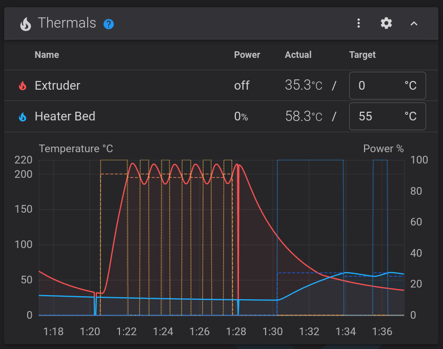](resources/heaters_calib.png)


### Bed Mesh
Created initial bed mesh before fixing anything using GUI `HEIGHTMAP` clicking `CALIBRATE` and then running `SAVE_CONFIG` in console
result:  
[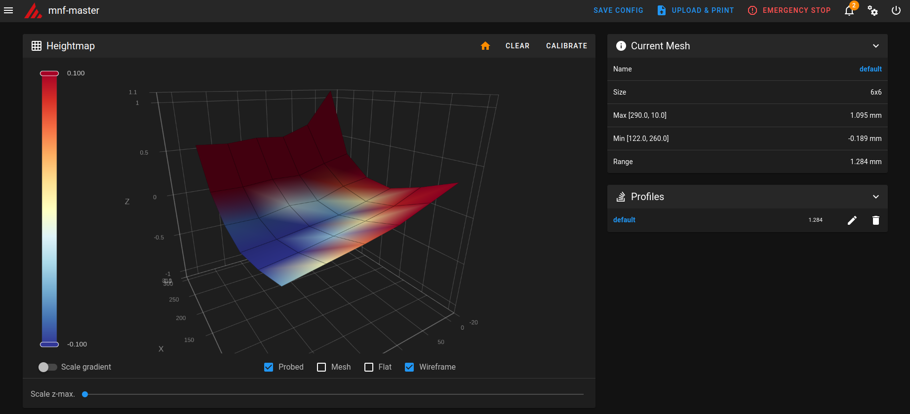](resources/initial_bed.png)

After that used
```
SCREWS_TILT_CALCULATE
```
to adjust screws and bring all corner to the same plane, and running mesh again:  
[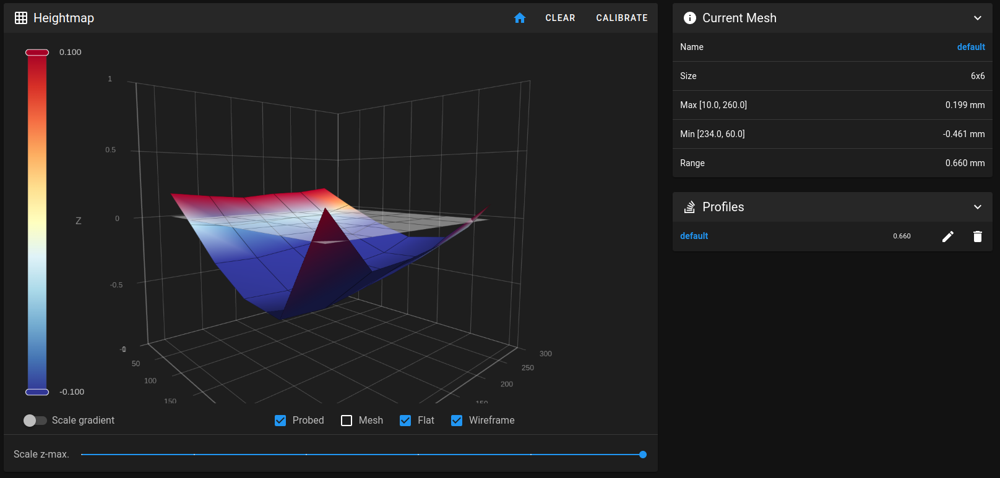](resources/final_bed.png)

Interestingly, I added plastic rectangle below PEI flexible top and the mesh didn't change, then added metallic ruler and the sensor was triggered even before going down. It means, that the sensor measures metal plate/magnetic sticker and not real bed position. Hopefully, switching to steel PEI plate will solve the issue. 
Another option is to switch to BLTouch sensor that uses mechanical contact instead of inductive proximity sensor.

### Extrusion speed
Repeating experiment from this video:  
https://www.youtube.com/watch?v=0xRtypDjNvI  
[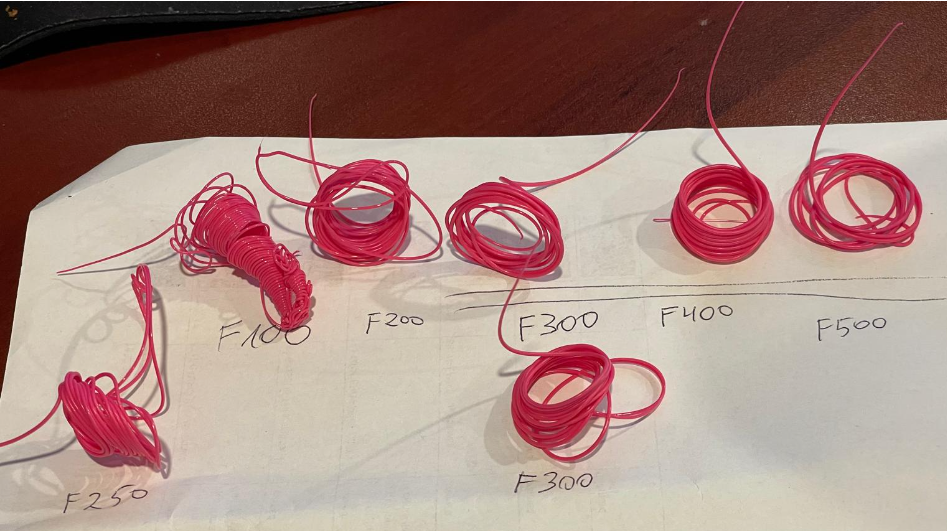](resources/extrusion_300mm.png)

|F [mm/min] | E300mm [gr]|
|---|---|
|100|0.82|
|200|0.81|
|250|0.79|
|300|0.74|
|300|0.71|
|400|0.63|
|500|0.5|
  
[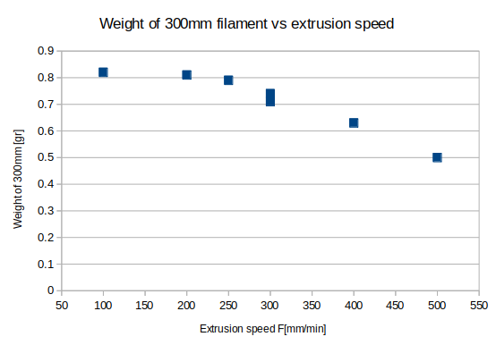](resources/extrusion_weight_graph.png)

So it seems that printing above `F200` starts extrude less material.

The `200mm/min` of `1.75mm` filament is equal `8.0176 mm^3/s`
```
200/60*(1.75/2)^2*pi = 8.0176 mm^3/s
```

Later tried to increase tension between gears and filament using adjustment screw and the results:

|F [mm/min] | E300mm [gr]|
|---|---|
|300|0.79|
|400|0.70|

So `300mm/min` seems ok:
```
300/60*(1.75/2)^2*pi = 12.026 mm^3/s
```


### Pressure Advance (PA) calibrations

Uses to start pushing fillament a little before starting printing and stopping extruding a little earlier, to compensate for long Bowden tubing that connects extruder and printing head and gives slack for filament to move and compress like spring inside tubing.

Using Orca slicer's `Calibrations` menu created PA pattern for Bowden printers:  
[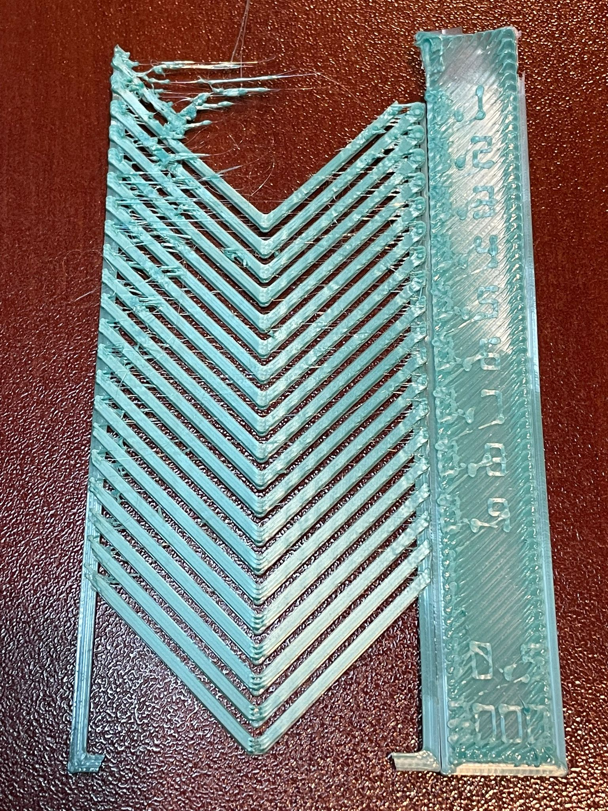](resources/PA_calibration.jpeg)

Looking at the corners, at 0.6 it looks sharp and the under-extrusion just starts.

The value was put into config and into slicer settings.
```
[extruder]
...
pressure_advance = 0.6
...
```

After configuring this I started to get Klipper errors of `MCU 'mcu' shutdown: Stepper too far in past`. Few evening past, I understood that it happens at short intervals and interplays between feed rate (`F`) and `PA` values. Still, didn't solve it completely. 

### Input Shaper

Used to modify frequency of pulses provided to motors to avoid generating oscillations due to mechanical resonances in printer construction.

Calibrated accordingly to [Klipper manual](https://www.klipper3d.org/Resonance_Compensation.html)

My initial prints and comparison of 2 methods `EI` and `MZV`. Haven't learned them yet, but sticked to recommendation to use `MZV` as less smoothing.

3 prints:
 - `-` - no input shaping, starting accel=1000, step 500
 - `MZV` - starting accel=500, step 1000
 - `EI` - starting accel=500, step 1000

X axis:
  
[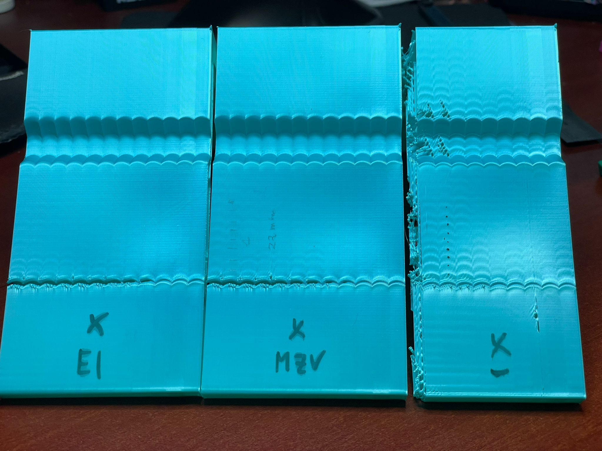](resources/input_shaper_x.jpeg)

Y axis:

[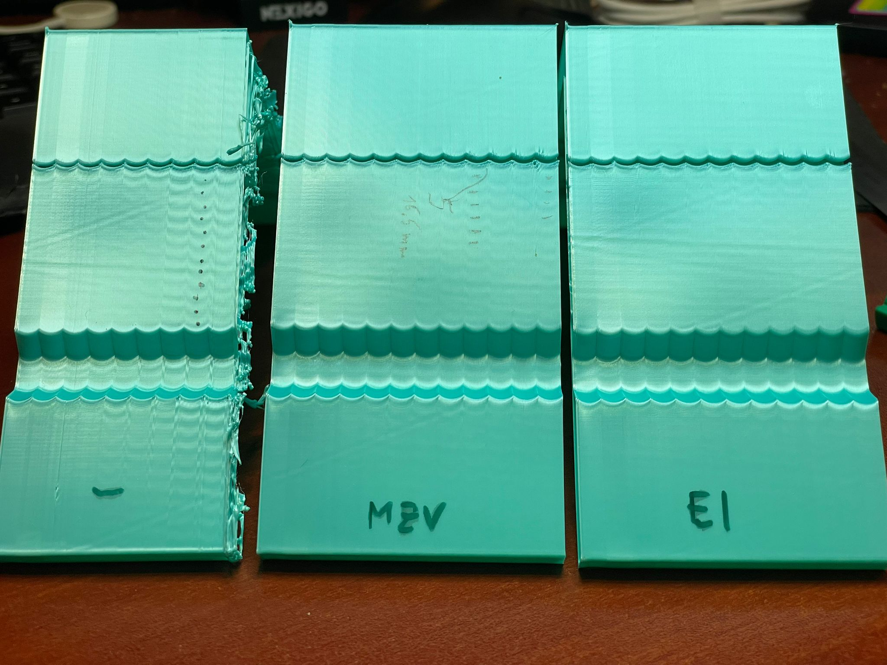](resources/input_shaper_y.jpeg)

Initial input shaper print failed because vibrations and probably bad cleaning of printer head before print. Solved by enabling `skirt` in slicer and so few loops of filament are extruded around model and so all leakages are wiped off before starting.

### Retraction
I run retraction calibration of mix of 4 to 1 with equal ratios 25%/25%/25%/25%:  

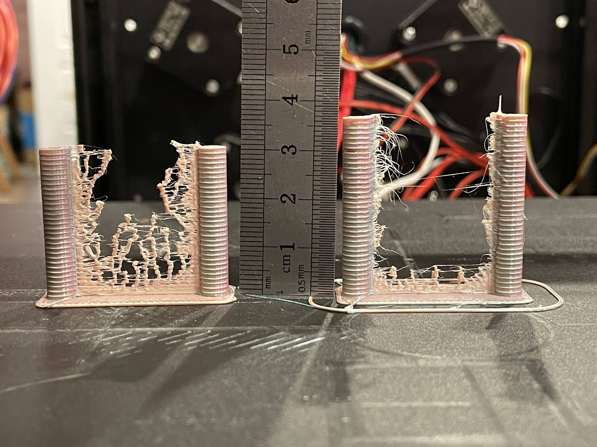


The left tower is 0.5mm/mm from h=0 to 30mm, providing retraction values from r=0 to 15mm and given mix ratios 0f 25% it means each color was retracted at the peak by 15/4=3.75mm (while recommended is 5..8mm) and as seen from results for all values the head was oozing heavily.

The right tower, is 1mm/mm from r=12mm retraction at h=0mm to r=48mm at h=36mm.

As seen from the left tower, the retraction of 3.75mm is not enough.
From the right, the optimum is probably somewhere between h=6 to 10mm so r=18 to 22mm, choosing 20mm give that each filament was retracted by 20*0.25=5mm.

The problem that depending on mixing ratio, the filaments will be retracted by default distances.
To solve it I created macros for FW retraction G10/G11, that ignore mixing factors and retract by hardcoded 5mm value.

During testing ti gave better results, but running longer print, the filaments that are not participating in mixing, retracted back and forth at the same point and extruder's gear cuts into it and breaks the filament.

The solution was modifying macros one more time retracting only active filaments:
(I added to `M164` to store also normalized mixed factors and so very small values mean these filaments are not active)


```python
[gcode_macro M164]
description: Applies the set mixing factors to the extruders
# default values:
variable_e0_parts : 100
variable_e1_parts : 0
variable_e2_parts : 0
variable_e3_parts : 0
variable_e0_norm : 0
variable_e1_norm : 0
variable_e2_norm : 0
variable_e3_norm : 0
gcode:
    # normalize the parts to sum of 1
    SET_GCODE_VARIABLE MACRO=M164 VARIABLE=e0_norm VALUE={e0_parts / (e0_parts + e1_parts + e2_parts + e3_parts) | float}
    SET_GCODE_VARIABLE MACRO=M164 VARIABLE=e1_norm VALUE={e1_parts / (e0_parts + e1_parts + e2_parts + e3_parts) | float}
    SET_GCODE_VARIABLE MACRO=M164 VARIABLE=e2_norm VALUE={e2_parts / (e0_parts + e1_parts + e2_parts + e3_parts) | float}
    SET_GCODE_VARIABLE MACRO=M164 VARIABLE=e3_norm VALUE={e3_parts / (e0_parts + e1_parts + e2_parts + e3_parts) | float}
    M118 scaled rot-dist_e0 { printer.configfile.settings.extruder.rotation_distance / (e0_norm + 0.000001) | float }
    M118 scaled rot-dist_e1 { printer.configfile.settings['extruder_stepper extruder_1'].rotation_distance / (e1_norm + 0.000001) | float }
    M118 scaled rot-dist_e2 { printer.configfile.settings['extruder_stepper extruder_2'].rotation_distance / (e2_norm + 0.000001) |float }
    M118 scaled rot-dist_e3 { printer.configfile.settings['extruder_stepper extruder_3'].rotation_distance / (e3_norm + 0.000001) |float }
    # activate stepper percentages
    SYNC_EXTRUDER_MOTION EXTRUDER=extruder MOTION_QUEUE=extruder
    SYNC_EXTRUDER_MOTION EXTRUDER=extruder_1 MOTION_QUEUE=extruder
    SYNC_EXTRUDER_MOTION EXTRUDER=extruder_2 MOTION_QUEUE=extruder
    SYNC_EXTRUDER_MOTION EXTRUDER=extruder_3 MOTION_QUEUE=extruder
    SET_EXTRUDER_ROTATION_DISTANCE EXTRUDER=extruder DISTANCE={ printer.configfile.settings.extruder.rotation_distance / (e0_norm+0.000001)|float }
    SET_EXTRUDER_ROTATION_DISTANCE EXTRUDER=extruder_1 DISTANCE={ printer.configfile.settings['extruder_stepper extruder_1'].rotation_distance / (e1_norm+0.000001)|float }
    SET_EXTRUDER_ROTATION_DISTANCE EXTRUDER=extruder_2 DISTANCE={ printer.configfile.settings['extruder_stepper extruder_2'].rotation_distance / (e2_norm+0.000001)|float }
    SET_EXTRUDER_ROTATION_DISTANCE EXTRUDER=extruder_3 DISTANCE={ printer.configfile.settings['extruder_stepper extruder_3'].rotation_distance / (e3_norm+0.000001)|float }
    M118 Mixing factors {e0} {e1} {e2} {e3} are activated

[gcode_macro G10]
description: performs retraction and temporary cancels mixing factors but only on active extruders e_norm < 0.001
# default values:
variable_retraction_distance : 5
variable_feedrate: 40
gcode:
    
    
    
    
    # activate stepper percentages
    SYNC_EXTRUDER_MOTION EXTRUDER=extruder MOTION_QUEUE=extruder
    SYNC_EXTRUDER_MOTION EXTRUDER=extruder_1 MOTION_QUEUE=extruder
    SYNC_EXTRUDER_MOTION EXTRUDER=extruder_2 MOTION_QUEUE=extruder
    SYNC_EXTRUDER_MOTION EXTRUDER=extruder_3 MOTION_QUEUE=extruder
    
        SET_EXTRUDER_ROTATION_DISTANCE EXTRUDER=extruder DISTANCE={ printer.configfile.settings.extruder.rotation_distance / (e0_norm+0.000001) | float }
    
        SET_EXTRUDER_ROTATION_DISTANCE EXTRUDER=extruder DISTANCE={ printer.configfile.settings.extruder.rotation_distance | float }
    
    
        SET_EXTRUDER_ROTATION_DISTANCE EXTRUDER=extruder_1 DISTANCE={ printer.configfile.settings['extruder_stepper extruder_1'].rotation_distance / (e1_norm+0.000001) | float }
    
        SET_EXTRUDER_ROTATION_DISTANCE EXTRUDER=extruder_1 DISTANCE={ printer.configfile.settings['extruder_stepper extruder_1'].rotation_distance | float }
    
    
        SET_EXTRUDER_ROTATION_DISTANCE EXTRUDER=extruder_2 DISTANCE={ printer.configfile.settings['extruder_stepper extruder_2'].rotation_distance / (e2_norm+0.000001) | float }
    
        SET_EXTRUDER_ROTATION_DISTANCE EXTRUDER=extruder_2 DISTANCE={ printer.configfile.settings['extruder_stepper extruder_2'].rotation_distance | float }
    
    
        SET_EXTRUDER_ROTATION_DISTANCE EXTRUDER=extruder_3 DISTANCE={ printer.configfile.settings['extruder_stepper extruder_3'].rotation_distance / (e3_norm+0.000001) | float }
    
        SET_EXTRUDER_ROTATION_DISTANCE EXTRUDER=extruder_3 DISTANCE={ printer.configfile.settings['extruder_stepper extruder_3'].rotation_distance | float }
    
    M118 Retracting all active extruders by {retraction_distance} mm
    G1 E-{retraction_distance} F{feedrate*60 | float}

[gcode_macro G11]
description: performs unretraction and sets back mixing factors
# default values:
variable_unretraction_distance : 5
variable_feedrate: 40
gcode:
    
    
    
    
    # activate stepper percentages
    SYNC_EXTRUDER_MOTION EXTRUDER=extruder MOTION_QUEUE=extruder
    SYNC_EXTRUDER_MOTION EXTRUDER=extruder_1 MOTION_QUEUE=extruder
    SYNC_EXTRUDER_MOTION EXTRUDER=extruder_2 MOTION_QUEUE=extruder
    SYNC_EXTRUDER_MOTION EXTRUDER=extruder_3 MOTION_QUEUE=extruder
    
        SET_EXTRUDER_ROTATION_DISTANCE EXTRUDER=extruder DISTANCE={ printer.configfile.settings.extruder.rotation_distance / (e0_norm+0.000001) | float }
    
        SET_EXTRUDER_ROTATION_DISTANCE EXTRUDER=extruder DISTANCE={ printer.configfile.settings.extruder.rotation_distance | float }
    
    
        SET_EXTRUDER_ROTATION_DISTANCE EXTRUDER=extruder_1 DISTANCE={ printer.configfile.settings['extruder_stepper extruder_1'].rotation_distance / (e1_norm+0.000001) | float }
    
        SET_EXTRUDER_ROTATION_DISTANCE EXTRUDER=extruder_1 DISTANCE={ printer.configfile.settings['extruder_stepper extruder_1'].rotation_distance | float }
    
    
        SET_EXTRUDER_ROTATION_DISTANCE EXTRUDER=extruder_2 DISTANCE={ printer.configfile.settings['extruder_stepper extruder_2'].rotation_distance / (e2_norm+0.000001) | float }
    
        SET_EXTRUDER_ROTATION_DISTANCE EXTRUDER=extruder_2 DISTANCE={ printer.configfile.settings['extruder_stepper extruder_2'].rotation_distance | float }
    
    
        SET_EXTRUDER_ROTATION_DISTANCE EXTRUDER=extruder_3 DISTANCE={ printer.configfile.settings['extruder_stepper extruder_3'].rotation_distance / (e3_norm+0.000001) | float }
    
        SET_EXTRUDER_ROTATION_DISTANCE EXTRUDER=extruder_3 DISTANCE={ printer.configfile.settings['extruder_stepper extruder_3'].rotation_distance | float }
    
    M118 Unretracting all active extruders by {unretraction_distance} mm
    G1 E{unretraction_distance} F{feedrate*60 | float}
    M118 Returning mixing factors
    M164


```



Continue to [OrcaSlicer configuration](../OrcaSlicer/)...